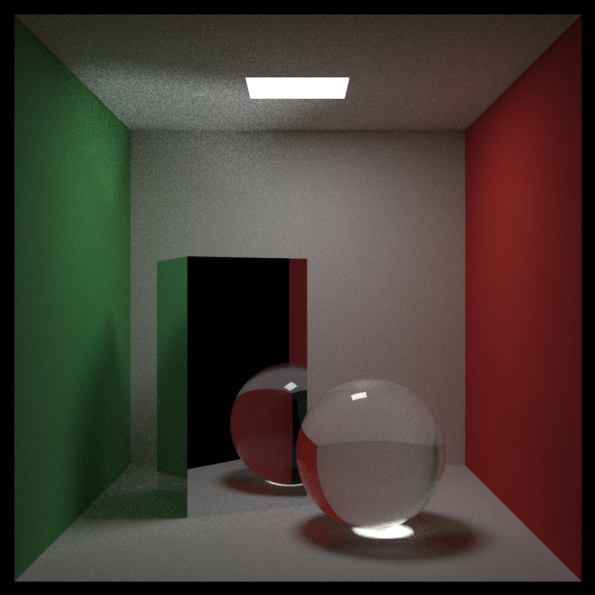
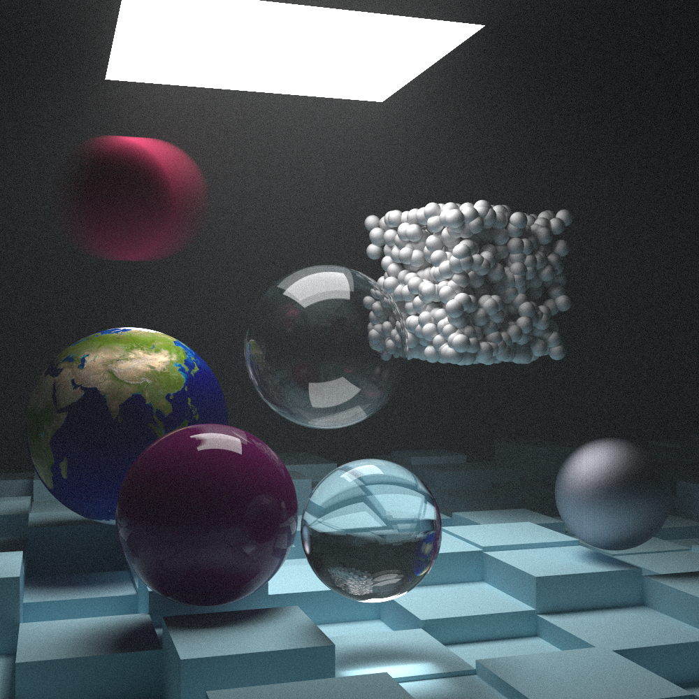
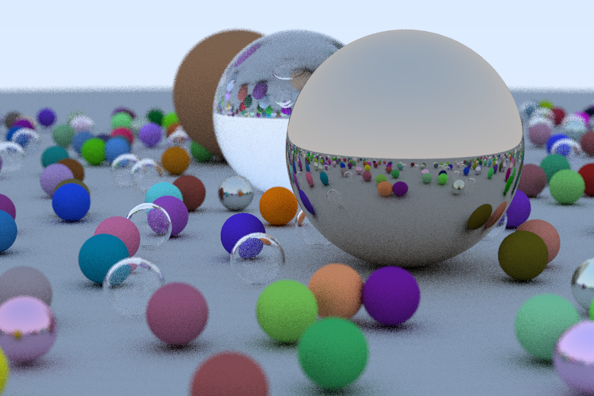

weeker_raytracer
================

Started with v2 of https://github.com/RayTracing/raytracing.github.io here are some examples

#### Rest Of Life

1000x1000 pixels with 500 ray samples around each point. took 1 hour, 8 minutes



#### The Next Week

1000x1000 pixels with 2500 ray samples around each point. took over 18 hours



#### In One Weekend

Image took about 12.3 minutes, without BVH. When generating same scene with BVH partitioning, took about 3 minutes.



Build
-----

-	Using `cmake`
-	Source code needs c++11 compatible compiler

```shell
cmake -B build
cmake --build build
```

-	specify the target with the `--target <program>` option, where the program may be `inOneWeekend`, `theNextWeek`, `restOfLife`

	```
	cmake --build build --target inOneWeekend
	cmake --build build --target theNextWeek
	cmake --build build --target restOfLife
	```

Use `cmake -DCMAKE_EXPORT_COMPILE_COMMANDS=ON` so that emacs irony-mode can know the compiler flags

```
cmake -DCMAKE_EXPORT_COMPILE_COMMANDS=ON -B build
```

## Build CUDA

```
cmake -DCMAKE_EXPORT_COMPILE_COMMANDS=ON -B build
```


	```
	cmake --build build --target inOneWeekendCuda
    build/inOneWeekendCuda >! output/cu1.ppm
	```


Run
---

build, then

```bash
# bang is used here for my zsh setup to clobber existing file
time ( build/program >! output/iname.ppm )
```
