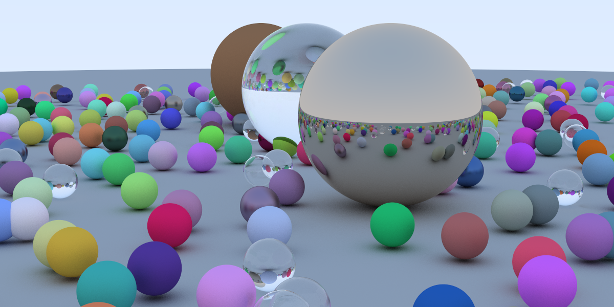

Started with v2 in C++ from Peter Shirley's [Ray Tracing In One Weekend](https://github.com/RayTracing/raytracing.github.io) Book Series.

-	Implementations
	-	C++ (CPU)
	-	CUDA C++ (GPU)
	-	OptiX (Nvidia GPU SDK)
-	Multi-platform CMake builds
	-	C++ tested on Linux, macOS
	-	CUDA C++ and Optix 6.5 tested on Ubuntu amd64 19.10 (with Nvidia graphics card)

Build
=====

Using `cmake` as it supports multiple platforms and language environments.

The general flow:

```bash
cmake -B build src    # create build dir and generate
cmake --build build   # build all targets

# developer generation
cmake -DCMAKE_EXPORT_COMPILE_COMMANDS=ON \
    -B build src
```

Use `cmake -DCMAKE_EXPORT_COMPILE_COMMANDS=ON` so that, for example, emacs irony-mode can know the compiler flags and flycheck can work.

Run
===

build target(s), then

```bash
# bang is used here for my zsh setup to clobber existing file
time ( build/program >! output/iname.ppm )
```

The `time` shell wrapper is obviated when program itself outputs its duration.

A `.ppm` image file is a non-binary (text) format.

#### Advanced example(s) with additional command line parameters

```bash
build/theNextWeekOptix -v -s 2 -dx 1120 -dy 1120 -n 1024 >! output/test1.ppm
```

In this example

-	`-v` sets **verbose** output
-	`-s 2` selects **scene** number two
-	`-dx 1120 -dy 1120` sets image to be of width and height **1120x1120**
-	`-n 1024` collect **1024** sampled rays per pixel

Not all executables have the same options, or possible have none at all.

Build C++ (Cpp)
---------------

-	Source code needs c++11 compatible compiler (e.g., g++-8, g++-9, clang)

```bash
cmake -DCMAKE_EXPORT_COMPILE_COMMANDS=ON -B build src
```

-	specify the target with the `--target <program>` option

	```
	cmake --build build --target inOneWeekendCpp
	cmake --build build --target theNextWeekCpp
	cmake --build build --target restOfLifeCpp
	```

Build CUDA C++ (Cuda)
---------------------

Code based on https://github.com/rogerallen/raytracinginoneweekendincuda

```
cmake -DCMAKE_EXPORT_COMPILE_COMMANDS=ON  -B build src

# target specific SM
cmake -DCMAKE_EXPORT_COMPILE_COMMANDS=ON \
      -DCMAKE_CUDA_FLAGS="-arch=sm_75" \
      -B build src
```

the CUDA targets

```
cmake --build build --target inOneWeekendCuda
cmake --build build --target theNextWeekCuda
```

 Above: `inOneWeekendCuda` output, around four seconds to render.

Build OptiX 6.5 (Optix)
-----------------------

Code based on

-	https://github.com/trevordblack/OptixInOneWeekend

Uses cmake

```bash
# or set other flags
cmake -DCMAKE_EXPORT_COMPILE_COMMANDS=ON \
    -DCMAKE_CUDA_FLAGS="--use_fast_math --generate-line-info" \
    -B build src

# Other CMAKE_CUDA_FLAGS
#   --relocatable-device-code=true
#   --verbose
```

build specific targets

```
cmake --build build --target inOneWeekendOptix --clean-first
cmake --build build --target theNextWeekOptix
```

 1200x600 pixels, 1K rays launched per pixel. Render time about 2.5 seconds using OptiX on an RTX card.

Tested on
---------

-	Ubuntu Linux 19.10 amd64
-	cmake version 3.13.4 (`3.13.4-1build1`) - 3.8 and 3.11 add incremental features for CUDA
-	g++-8 version 8.3.0 (`Ubuntu 8.3.0-23ubuntu2`) - alternative to g++-9 that is default in Ubuntu 19.10

### CUDA Tested on

-	CUDA toolkit 10.1 V10.1.168 (from `nvidia-cuda-toolkit` installer)
	-	it installs dependency gcc-8 (gcc-9 is not yet supported in CUDA toolchain)
	-	nsight compute 2019.5 (manual download and install from nvidia dev site)
	-	nvcc version: Cuda compilation tools, release 10.1, V10.1.168
-	Nvidia RTX 2070 Super (Supports SM 7.5)

#### OptiX Tested on

Same as CUDA above.

Optix 6.5.0 SDK install at `/usr/local/nvidia/NVIDIA-OptiX-SDK-6.5.0-linux64`

Early performance comparisons
-----------------------------

Ray Tracing In One Weekend final scene

-	Single thread CPU: Image took about **12.3 minutes**, without BVH. (4960X EE)
-	Single thread CPU: When generating same scene with BVH partitioning, took about **3 minutes**.
-	CUDA GPU version: When generating same scene without BVH partitioning, less than **4 seconds**
-	OptiX GPU version: When generating similar scene at 1K samples per pixel, less than **2.5 seconds**

Image Renders (C++ Single Thread CPU)
-------------------------------------

### In One Weekend


1200x800 pixels, 20 rays per pixel. Image took about 12.3 minutes, without BVH partitioning. When generating same scene with BVH, took about 3 minutes.

### The Next Week


1000x1000 pixels with 2500 rays per pixel. took over 18 hours

### Rest Of Life

Top Image above of the Cornell box: 1000x1000 pixels with 500 rays per pixel. Took 1 hour, 8 minutes
