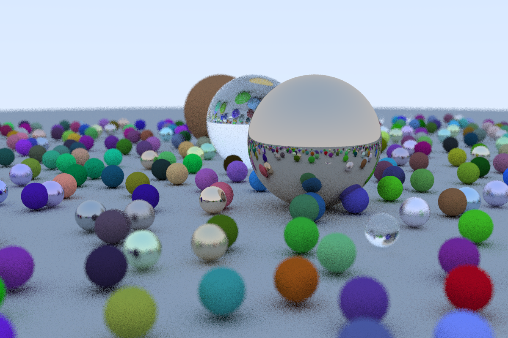

weeker_raytracer
================

Started at v2 of [Ray Tracing In One Weekend Book Series
](https://github.com/RayTracing/raytracing.github.io). Converted build to `CMake` and started on a CUDA C++ version.


Source code in the repository

 - Support multi-platform CMake C++ builds (Linux, macOS)
   - both C++ and CUDA C++ versions work on Ubuntu 19.10

## Final Outputs From Each Book's Results

#### Rest Of Life

Image above: 1000x1000 pixels with 500 ray samples around each point. took 1 hour, 8 minutes


#### The Next Week

1000x1000 pixels with 2500 ray samples around each point. took over 18 hours


#### In One Weekend

Image took about 12.3 minutes, without BVH. When generating same scene with BVH partitioning, took about 3 minutes.


Build
-----

-	Using `cmake`
-	Source code needs c++11 compatible compiler (e.g., g++-8, g++-9)

```shell
cmake -B build
cmake --build build
```

-	specify the target with the `--target <program>` option, where the program may be `inOneWeekend`, `theNextWeek`, `restOfLife`

	```
	cmake --build build --target inOneWeekend
	cmake --build build --target theNextWeek
	cmake --build build --target restOfLife
	```

Use `cmake -DCMAKE_EXPORT_COMPILE_COMMANDS=ON` so that emacs irony-mode can know the compiler flags

```
cmake -DCMAKE_EXPORT_COMPILE_COMMANDS=ON -B build
```

## Build CUDA


Code based on https://github.com/rogerallen/raytracinginoneweekendincuda

```
cmake -DCMAKE_EXPORT_COMPILE_COMMANDS=ON  -B build
# or target specific SM
cmake -DCMAKE_EXPORT_COMPILE_COMMANDS=ON \
      -DCMAKE_CUDA_FLAGS="-arch=sm_75" -B build
```

	cmake --build build --target inOneWeekendCuda
	cmake --build build --target theNextWeekCuda


#### CUDA Tested on
 - Ubuntu Linux 19.10
 - CUDA toolkit 10.1 V10.1.168 (from `nvidia-cuda-toolkit` installer)
   - it installs dependency gcc-8 (gcc-9 is not yet supported in CUDA toolchain)
   - nsight compute 2019.5 (manual download and install from nvidia dev site)
 - Nvidia RTX 2070 Super (Supports SM 7.5)

Other versions

 - cmake version 3.13.4 (3.8 and 3.11 add incremental features for CUDA)
 - g++-8 (Ubuntu 8.3.0-23ubuntu2) 8.3.0
 - nvcc version: Cuda compilation tools, release 10.1, V10.1.168

Early performance comparisons

 - Single thread CPU: Image took about 12.3 minutes, without BVH.
 - Single thread CPU: When generating same scene with BVH partitioning, took about 3 minutes.
 - CUDA GPU version: When generating same scene without BVH partitioning, less than 4 **seconds**




## Build OptiX


Code based on

 - https://github.com/trevordblack/OptixInOneWeekend
   - https://github.com/trevordblack/OptixInOneWeekend/tree/tdb/old_directory_structure

```
cmake -DCMAKE_EXPORT_COMPILE_COMMANDS=ON  -B build

# or set other flags
cmake -DCMAKE_EXPORT_COMPILE_COMMANDS=ON \
    -DCMAKE_CUDA_FLAGS="--use_fast_math --relocatable-device-code=true" \
    -B build

# --generate-line-info
```

	cmake --build build --target inOneWeekendOptix
    cmake --build build --target inOneWeekendOptix --clean-first


#### running optix

```
build/src/OptiX/InOneWeekend/inOneWeekendOptix > output/grad.ppm
```


#### OptiX Tested on

 - Optix 6.5.0 SDK
 - cmake 3.13.4

# Run

build, then

```bash
# bang is used here for my zsh setup to clobber existing file
time ( build/program >! output/iname.ppm )
```

The `time` shell wrapper is mostly redundant in the CUDA version since it records and outputs its duration.
